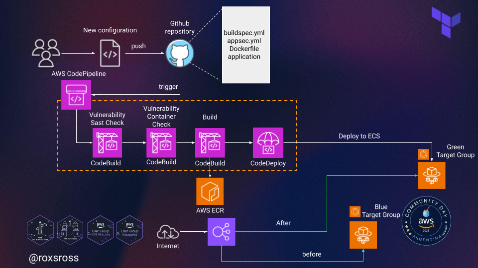
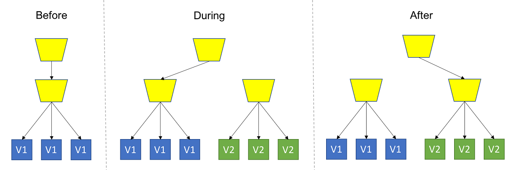
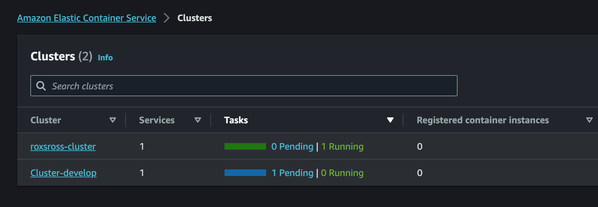
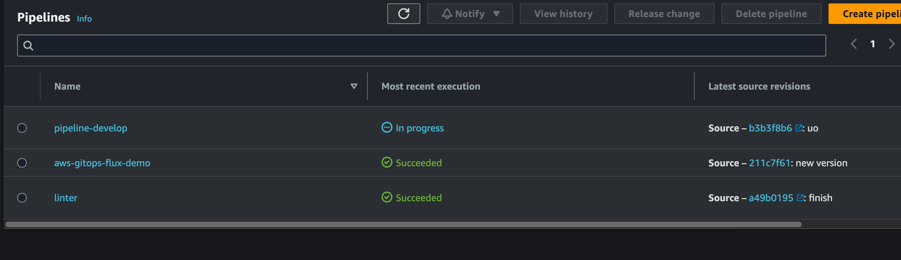
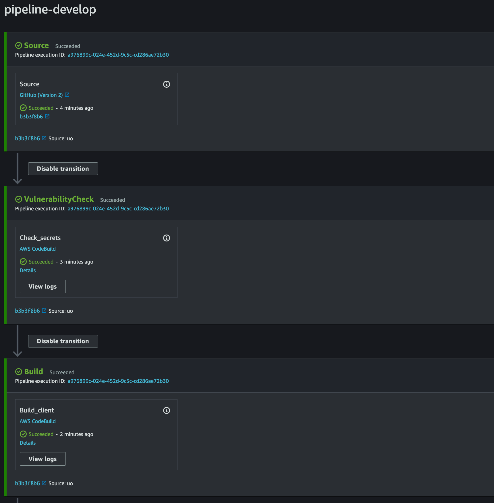
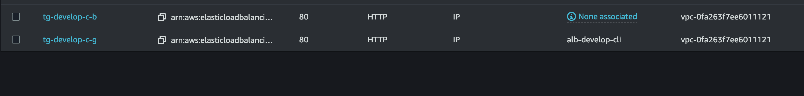
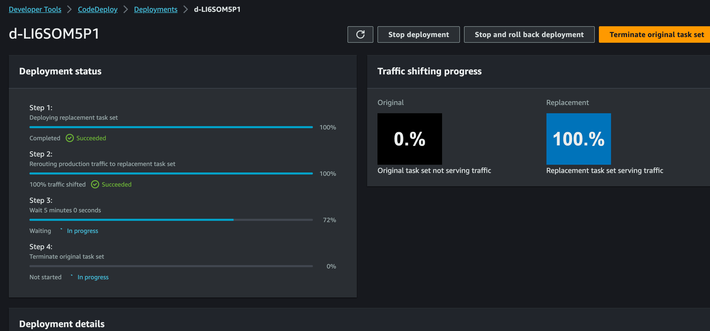
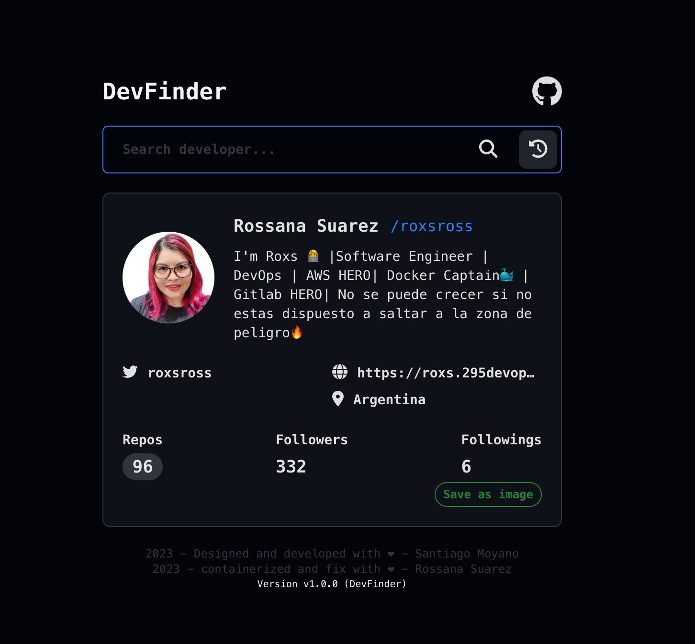

# aws-arg-demo-ecs-app
Time to Demo. AWS ECS by RoxsRoss [AWS Community Day Argentina 2023]



## Sobre Amazon Elastic Container Service

Amazon Elastic Container Service, también conocido como Amazon ECS, es un tipo de servicio que permite la administración, implementación y el escalado de aplicaciones en contenedores y que se caracteriza por ser totalmente gestionado. Este servicio será de gran utilidad para tus labores de orquestación de contenedores, por lo que es importante que conozcas, gracias a este post, los beneficios de Amazon ECS de mayor relevancia.

> Uno de los principales beneficios de Amazon ECS es que funciona como un servicio elástico completamente administrado, por lo que el usuario no deberá preocuparse de los procesos de gestión y administración del plano de control.

## Estrategia de Despliegue Blue/Green

La implementación Blue/Green es un modelo de lanzamiento de aplicaciones que intercambia el tráfico de una versión anterior de una aplicación o microservicio a una nueva versión. La versión anterior se llama entorno blue, mientras que la nueva versión se llama entorno green.

En este modelo, es esencial para garantizar su preparación para manejar el tráfico de producción. Una vez superadas las pruebas, esta nueva versión se promueve a producción reconfigurando el balanceador de carga para transferir el tráfico entrante del entorno blue al entorno green, ejecutando por fin la última versión de la aplicación.

El uso de esta estrategia aumenta la disponibilidad de las aplicaciones y reduce el riesgo operativo , al mismo tiempo que se simplifica el proceso de reversión.



## Uso de Terraform para construir un sistema de despliegue de blue/green en ECS

Crear un clúster ECS y un pipeline que cree la nueva versión de la imagen del contenedor para implementarla en modo blue/green no es difícil en sí mismo, pero requiere la creación de muchos recursos en la nube para coordinar. 

### Requisitos previos
- Tener instalado terraform
- Contar con token de github
- Acceso a las claves programaticas de AWS

### Mano a la obra

#### crear un archivo de configuracion para agregar las variables

- Estructura del terraform.tfvars, tambien puede manejarlos por ambiente con terraform workspace

<pre><code>
    aws_profile      = "xxxx"
    aws_region       = "xxxx"
    environment_name = "xxxx"
    github_token     = "xxxx"
    repository_name  = "xxxxx"
    repository_owner = "xxxxx" 
</code></pre>    

#### inicializar el proyecto de terraform

- Se debe ubicar en la carpeta Infra, donde encontras todos los modulos que se requiere para el aprovisionamiento de la infra

```
infra
├── Modules
│   ├── ALB
│   │   ├── main.tf
│   │   ├── outputs.tf
│   │   └── variables.tf
│   ├── CodeBuild
│   │   ├── main.tf
│   │   ├── outputs.tf
│   │   └── variables.tf
│   ├── CodeBuildSecurity
│   │   ├── main.tf
│   │   ├── outputs.tf
│   │   └── variables.tf
│   ├── CodeDeploy
│   │   ├── main.tf
│   │   ├── outputs.tf
│   │   └── variables.tf
│   ├── CodePipeline
│   │   ├── main.tf
│   │   ├── outputs.tf
│   │   └── variables.tf
│   ├── CodeStar
│   │   ├── main.tf
│   │   ├── outputs.tf
│   │   └── variables.tf
│   ├── ECR
│   │   ├── main.tf
│   │   ├── outputs.tf
│   │   └── variables.tf
│   ├── ECS
│   │   ├── Autoscaling
│   │   │   ├── main.tf
│   │   │   ├── outputs.tf
│   │   │   └── variables.tf
│   │   ├── Cluster
│   │   │   ├── main.tf
│   │   │   ├── outputs.tf
│   │   │   └── variable.tf
│   │   ├── Service
│   │   │   ├── main.tf
│   │   │   ├── outputs.tf
│   │   │   └── variables.tf
│   │   └── TaskDefinition
│   │       ├── main.tf
│   │       ├── outputs.tf
│   │       └── variables.tf
│   ├── IAM
│   │   ├── main.tf
│   │   ├── outputs.tf
│   │   └── variables.tf
│   ├── Networking
│   │   ├── main.tf
│   │   ├── outputs.tf
│   │   └── variables.tf
│   ├── S3
│   │   ├── main.tf
│   │   ├── outputs.tf
│   │   └── variables.tf
│   ├── SNS
│   │   ├── main.tf
│   │   ├── outputs.tf
│   │   └── variables.tf
│   └── SecurityGroup
│       ├── main.tf
│       ├── outputs.tf
│       └── variables.tf
├── Templates
│   ├── appspec.yaml
│   ├── buildspec-secrets.yml
│   ├── buildspec.yml
│   └── taskdef.json
├── main.tf
├── outputs.tf
├── terraform.tfvars
├── variables.tf
└── versions.tf
```

- Para iniciar el proyecto solo requieres correr el comando

`terraform init`

Resultado de la Salida:

```
> terraform init
Initializing the backend...
Initializing modules...
- alb_client in Modules/ALB
...
Initializing provider plugins...
- Finding hashicorp/aws versions matching "~> 5.15.0"...
...
Terraform has been successfully initialized!
```

#### Creando el Plan, pero recuerda usar el Validate para revisar que todo esta okey

`terraform validate`

```
Success! The configuration is valid, but there were some validation warnings as shown
above.
```

Ahora si vamos con el plan...

`terraform plan` 

Otra opcion:

`terraform plan --out plan.out` 

Resultado:

```
Plan: 49 to add, 0 to change, 0 to destroy.

```


#### Ahora si aplicamos todo.

`terraform apply --auto-approve`

Tambien podrias usar

`terraform apply "plan.out"`

#### Ahora toma un Cafe y a esperar la magia 


Wooo ..... 3m 6s tenemos magia..

#### Algunas capturas













#### CleanUp

Para destruir todo los recursos generados.

`terraform destroy --auto-approve`


Y si quieren eliminar todos los archivos de configuracion de Terraform, te ubicas en el root del directorio y ejecuta

`make clean`
```
> make clean
find . -type f -name "*.tfstate*" -prune -exec rm -rf {} \;
find . -type f -name "*.terraform.lock.hcl" -prune -exec rm -rf {} \;
find . -type d -name "*.terraform" -prune -exec rm -rf {} \;
find . -type d -name "*.out" -prune -exec rm -rf {} \;
```
##### Nos Vemos 🔥🔥🔥🔥

---
<p align="left" width="100%">
  <br>
     
</p>

⌨️ con ❤️ por [roxsross](https://github.com/roxsross) 😊

"No se trata de cambiar el mundo, creo que creas un cambio pequeño, pero que te importe estás cambiando las cosas".


[ ](https://blog.295devops.com)
[](https://dev.to/roxsross)

[](https://www.linkedin.com/in/roxsross/)
[](https://www.instagram.com/roxsross/)
[](https://www.youtube.com/channel/UCa-FcaB75ZtqWd1YCWW6INQ)